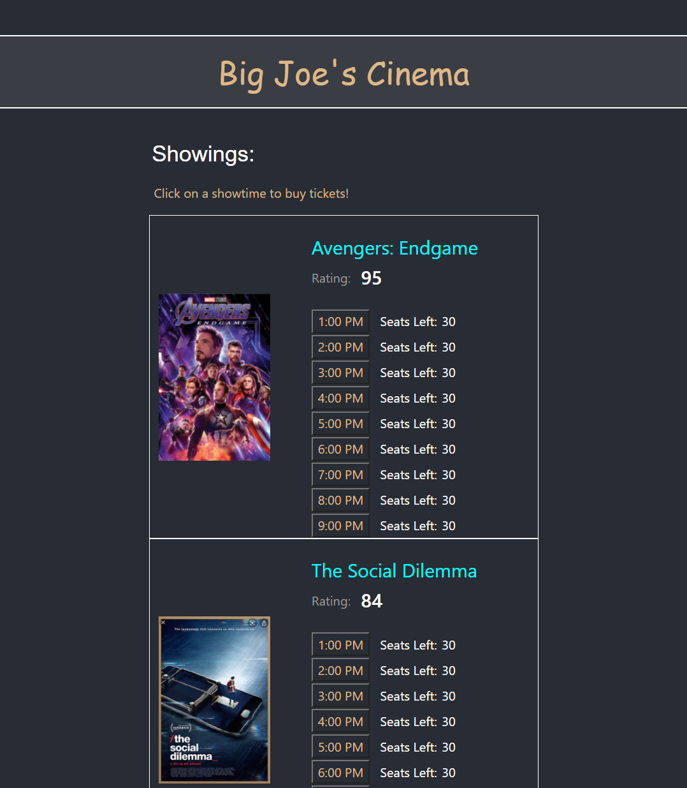
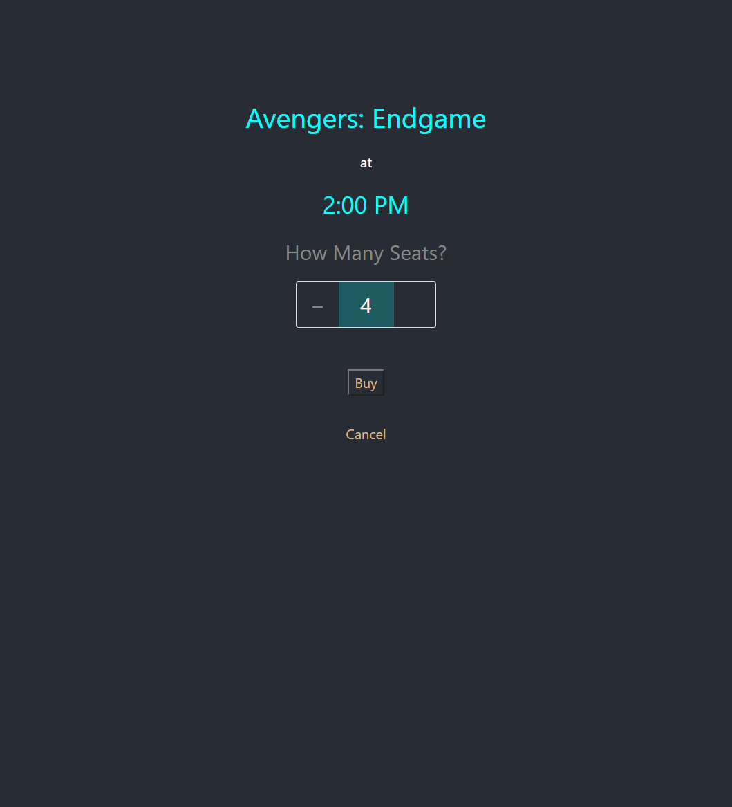
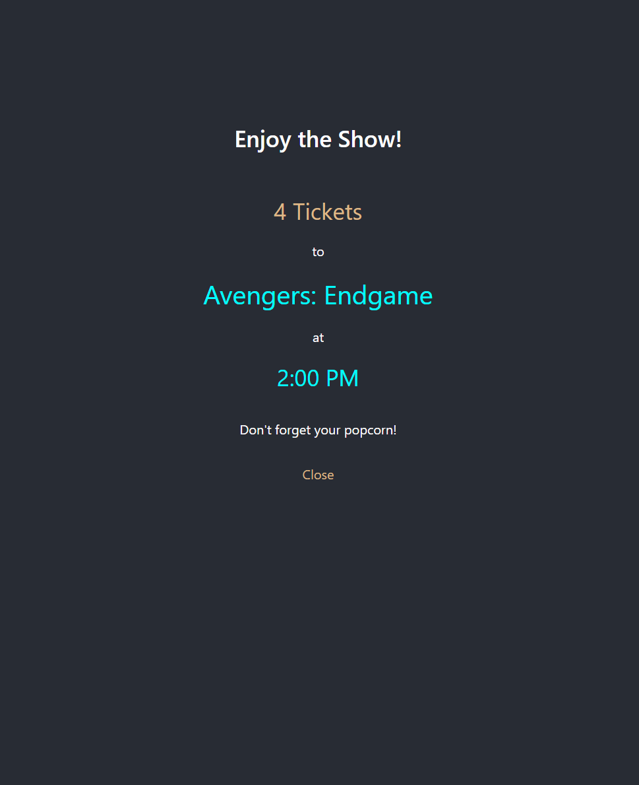
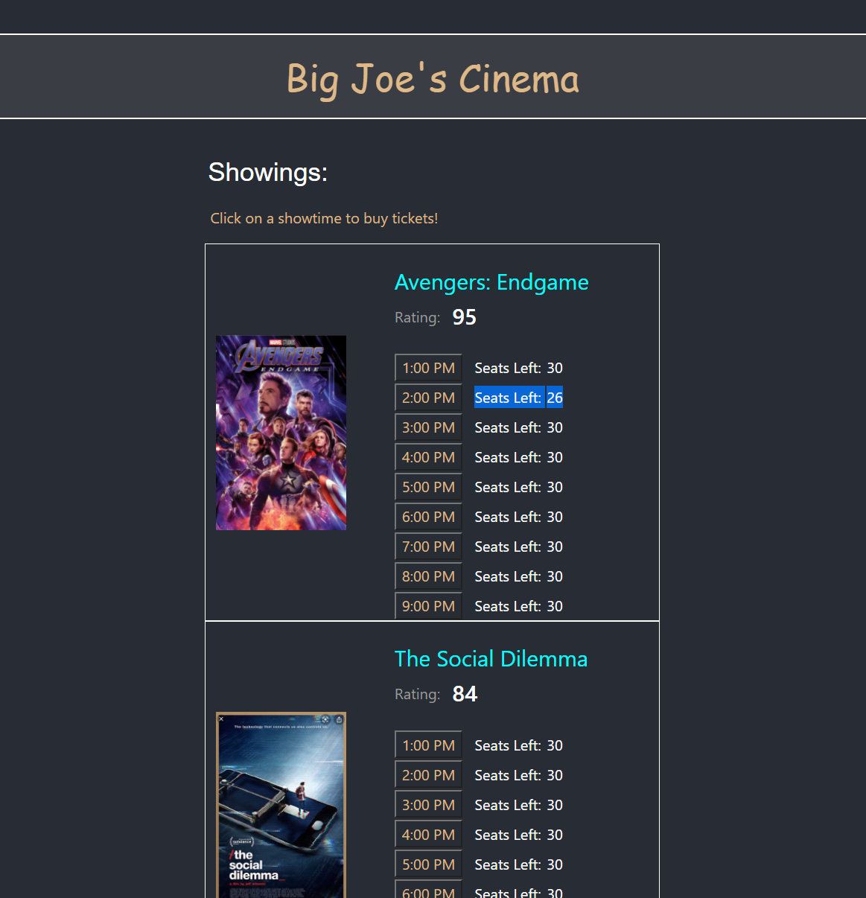

# Movie Theater

This is an example Spring Boot application that comes pre-packaged as a full-stack application.

### Function

The core functionality of this application is to store ticket sales in a database
and show customers only the number of seats that haven't been purchased for each
showtime.

Users select their showtime and number of tickets, click "Buy" and the application will
update the number of tickets available for a particular showtime.

### Design

##### Front End (React)

This application uses Maven to install `node` and `npm` and build 
the React front-end when the developer runs `mvn install`.

This is accomplished by adding the installations of `node` and `npm` and the building of
the React application to the `build` section of Maven's plugins. While Maven is installing 
the proper dependencies, it also installs the dependencies for the React front-end and 
configures the React front-end to launch with Spring's embedded TomCat server.

##### Containers (MySQL, Prometheus, & Grafana)

This application also uses Docker to stand up a MySQL instance for data persistence 
and Prometheus & Grafana containers for monitoring the application's health.

Inside `docker-compose.yml`, you can see we're establishing a Docker network with a few 
containers involved in communicating with the container that runs the application. This is 
similar to deploying all of these containers in the same Pod in Kubernetes.

The MySQL container will lose all data when it spins down, which is why a Kubernetes approach 
would serve much better for persisting data. 

The Prometheus container is designed to scrape metrics from Spring's Actuator endpoints, and 
the Grafana container hosts an instance of Grafana with dashboards built on top of the 
scraped data from Prometheus.

### Running the Application

To launch this application locally, run `mvn install && mvn spring-boot:run`.

To launch this application with Docker, run `docker-compose` on the `docker-compose.yml` file.

You will see the React pages generated at `localhost:8080/`.

### Demo

